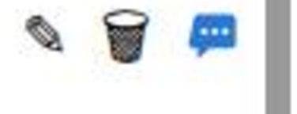
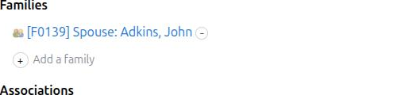
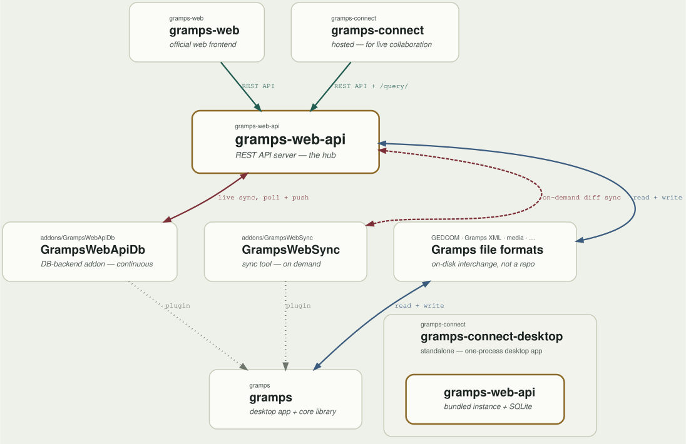

# Gramps Connect

Gramps Connect is a web frontend for [Gramps](https://gramps-project.org/),
the free genealogy software. It's built around two ideas: browsing and
searching your family tree should be fast, even on trees with tens
of thousands of people, and working on a tree with other family members
should be collaborative, showing you each other's edits as they happen
rather than requiring a page refresh. The goal is a faster, more
collaborative home for your genealogical research.

## Application

Gramps Connect can be installed as a standalone desktop app, for one
person working on their own tree, or set up as a hosted app that a
whole family can log into and share. Either way, the interface is the
same — the difference is only whether anyone else is in the tree with
you.

After logging in, you land on the **Home** page: a quick snapshot of
the tree, showing recent messages from other researchers, the most
recently changed records, and a running count of how many people,
families, events, and so on the tree contains.

Down the left-hand side is a row of icons, one per kind of record
Gramps keeps a list of:

* **People, Family, Events, Places** — the core of any tree
* **Repositories, Sources, Citations** — where your facts come from
* **Media, Notes, Tags** — photos, documents, free-text notes, and labels you attach to records
* **Output** — reports and exports the tree has produced, shared with everyone who can see the tree
* **Messages** — a running conversation attached to the tree itself, for leaving notes to other researchers

Across the top, the menu holds the actions that work on the tree as a
whole rather than on one record:

* **Family Trees** — import a GEDCOM or Gramps XML file, export one, or delete a tree
* **Add** — start a brand-new record of any kind
* **View** — switch to a Map or Timeline view of the tree instead of a list
* **Reports** — run one of Gramps' built-in reports against the current tree
* **Help** — this overview, plus version and system information

The user menu, in the corner, holds account-level settings: turning
desktop notifications on or off, switching between light and dark
themes, copying your API key for scripting, and signing out.

## Exploring Data

Each list view (People, Families, Events, Sources, and so on) splits the screen into two panes. The list on the left is your anchor: pick a row and it stays selected while you look around. The panel on the right shows everything related to that selection. For a person, that means their events, families, citations, notes, media, and more, grouped into sections.

Clicking on an item inside the related panel, such as a citation, a linked event, or a source, opens a Reference detail pane at the bottom of the screen showing that item's own details. The list and the related panel above stay exactly as they were, so you never lose your place.

This is the core idea: you can drill down as far as you like, for example person, then citation, then source, while the row you started from stays selected in the list and the related panel stays visible above. The three panes together (list, related panel, reference detail) keep the main context in view no matter how deep you go.

## Editing

The Edit button (✏️) for each main item opens the full editing form for this specific record: a person, family, event, and so on. Use it when you want to change the record's own details (a name, a date, a description) or when you want full control over its connections to other records, for example picking exactly how a child relates to their parents (birth, adopted, step-child...), or creating a brand-new person on the spot while filling in a family. It's the "everything editor" for one record at a time.

The "+" and "−" buttons on the detail panel are a shortcut for one narrow job: linking or unlinking two records that already exist, without opening the full form. Click "+" next to "Citations," "Children," "Events," and so on to attach an existing record of that kind; click the "−" next to something already listed to detach it. They don't change any of the record's own details, only what it's connected to.

In short:
- Want to fix a typo, change a date, or edit a description? Use Edit.
- Want to quickly attach a citation, add a child who already exists in your tree, or link an event, without a big form? Use "+" / "−" right on the page.
- Need to create something brand-new as part of a connection (like a new source or a new person)? That still goes through Edit: the "+" only picks from records that already exist.

One exception worth knowing: a person's Source can only be filled in with "+" if it's missing, not removed with "−" once set, since every citation is required to point at a source, so that connection can't be left empty.

## Working together, live

Family history is rarely done alone — a cousin has the photos, an aunt
remembers the names, someone else does the typing. Gramps Connect is
built around more than one person being in the tree at the same time:

- **You see each other's changes as they happen.** When someone else
  corrects a date or adds a person, the list you're looking at updates
  on its own. There's no need to reload the page, and no risk of
  working from a copy of the tree that went stale while you were
  reading it.
- **You can leave each other messages.** The Messages list is a
  conversation attached to the tree itself, not a separate chat app.
  Everyone who can see the tree can read it, including whoever joins
  next year.
- **What you produce is shared.** When you run a report or export the
  tree, the finished file doesn't just land in your own downloads
  folder — it appears in the Output list, where everyone else can find
  it and download it too.

## Under the hood

None of this — instant browsing, live updates — would work if every
click had to wait on the server to gather up a whole record and hand
it over. So Gramps Connect keeps its own compact copy of the tree
inside your browser, built by asking the server small, precise
questions ("give me the surname and birth year for these 50 people,
sorted this way") instead of everything about everyone. Those
questions are expressed in SQL, the standard language for asking a
database exactly what you need — which is what lets the server answer
quickly even on a tree with tens of thousands of people, and lets
your browser keep sorting and filtering instantly once it has the
answer.

That way of asking only exists because of
[gramps-object-query-language](https://github.com/dsblank/gramps-object-query-language),
or GOQL — a query language built for Gramps records that translates
down into SQL. GOQL is what made it possible to add the fast `/query/`
endpoints to gramps-web-api in the first place, so it's really the
foundation the whole project is built on, not just a detail underneath
it. It's also the same query language behind Gramps Connect's search
box, so a precise search — everyone named Smith born in Ohio before
1900, or every family whose mother and father were born in the same
place, say — is powered by the same mechanism that keeps browsing
fast. That second kind of search isn't limited to one record's own
fields, either: a single search can reach from a family to a parent,
from that parent to their own birth event, and from that event to a
place, following the connections between records as far as the
question needs. (GOQL isn't tied to Gramps Connect, either — it's also available
as a filter addon for Gramps desktop itself.) See [GOQL.md](GOQL.md)
for the details and examples of that search syntax.

## The Gramps ecosystem

Gramps Connect is the newest member of a family of Gramps-related
projects that all read and write the same underlying data:

- **Gramps** is the original desktop application — decades of features,
  running entirely on your own computer.
- **gramps-web-api** is the server at the center of the web ecosystem: it
  speaks to a shared family tree database and answers requests from
  web frontends.
- **gramps-web** is the established, full-featured web frontend for that
  server.
- **gramps-connect** is a newer web frontend for the same server, built
  around the speed and live-collaboration ideas described above.
- **gramps-connect-desktop** is a standalone build of Gramps Connect
  that bundles its own copy of gramps-web-api together with a small
  on-disk database, so it can also run as a single, self-contained
  desktop app for one person, with no separate server to set up.

They all trade data through the same well-known Gramps file formats —
GEDCOM and Gramps XML — so a tree can move between any of them.

